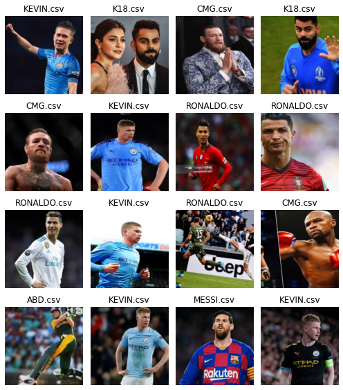

```python
from fastai.vision import *
```


```python
folder = "MESSI.csv"
file = "MESSI.csv"
```


```python
path = Path('data/players')
dest = path/folder
dest.mkdir(parents=True, exist_ok=True)
```


```python
download_images(file, dest,max_pics=200)
```


```python
folder = "RONALDO.csv"
file = "RONALDO.csv"
```


```python
path = Path('data/players')
dest = path/folder
dest.mkdir(parents=True, exist_ok=True)
```


```python
download_images(file, dest,max_pics=200)
```


```python
folder = "CURRY.csv"
file = "CURRY.csv"
```


```python
path = Path('data/players')
dest = path/folder
dest.mkdir(parents=True, exist_ok=True)
```


```python
download_images(file, dest,max_pics=200)
```


```python
folder = "KEVIN.csv"
file = "KEVIN.csv"
```


```python
path = Path('data/players')
dest = path/folder
dest.mkdir(parents=True, exist_ok=True)
```


```python
download_images(file, dest,max_pics=200)
```


```python
folder = "PEP.csv"
file = "PEP.csv"
```


```python
path = Path('data/players')
dest = path/folder
dest.mkdir(parents=True, exist_ok=True)
```


```python
download_images(file, dest,max_pics=200)
```


```python
folder = "CMG.csv"
file = "CMG.csv"
```


```python
path = Path('data/players')
dest = path/folder
dest.mkdir(parents=True, exist_ok=True)
```


```python
download_images(file, dest,max_pics=200)
```


```python
folder = "ABD.csv"
file = "ABD.csv"
```


```python
path = Path('data/players')
dest = path/folder
dest.mkdir(parents=True, exist_ok=True)
```


```python
download_images(file, dest,max_pics=200)
```


```python
folder = "K18.csv"
file = "K18.csv"
```


```python
path = Path('data/players')
dest = path/folder
dest.mkdir(parents=True, exist_ok=True)
```


```python
download_images(file, dest,max_pics=200)
```


```python
path.ls()
```


    [PosixPath('data/players/ABD.csv'),
     PosixPath('data/players/ABD'),
     PosixPath('data/players/CMG.csv'),
     PosixPath('data/players/CMG'),
     PosixPath('data/players/CURRY.csv'),
     PosixPath('data/players/CURRY'),
     PosixPath('data/players/K18.csv'),
     PosixPath('data/players/K18'),
     PosixPath('data/players/KEVIN.csv'),
     PosixPath('data/players/KEVIN'),
     PosixPath('data/players/MESSI.csv'),
     PosixPath('data/players/MESSI'),
     PosixPath('data/players/PEP.csv'),
     PosixPath('data/players/PEP'),
     PosixPath('data/players/RONALDO.csv'),
     PosixPath('data/players/RONALDO'),
     PosixPath('data/players/models'),
     PosixPath('data/players/960.jpg'),
     PosixPath('data/players/cleaned.csv'),
     PosixPath('data/players/curry.jpg'),
     PosixPath('data/players/export.pkl'),
     PosixPath('data/players/qwerty.jpg'),
     PosixPath('data/players/r7.jpeg'),
     PosixPath('data/players/ronaldo_.jpg'),
     PosixPath('data/players/young_.jpg')]


```python
classes = ['MESSI',"RONALDO","CURRY","KEVIN","PEP","CMG","ABD","K18"]

```


```python
for c in classes:
    print(c)
    verify_images(path/c, delete=True, max_size=500)
```

    MESSI
    RONALDO
    CURRY
    KEVIN
    PEP
    CMG
    ABD
    K18


```python
np.random.seed(42)
data = ImageDataBunch.from_folder(path, train=".", valid_pct=0.2,
        ds_tfms=get_transforms(), size=224, num_workers=4).normalize(imagenet_stats)
```


```python
data.classes
```


    ['ABD.csv',
     'CMG.csv',
     'CURRY.csv',
     'K18.csv',
     'KEVIN.csv',
     'MESSI.csv',
     'PEP.csv',
     'RONALDO.csv',
     'players']


```python
data.show_batch(rows=4, figsize=(7,8))
```





```python
data.classes, data.c, len(data.train_ds), len(data.valid_ds)
```


    (['ABD.csv',
      'CMG.csv',
      'CURRY.csv',
      'K18.csv',
      'KEVIN.csv',
      'MESSI.csv',
      'PEP.csv',
      'RONALDO.csv',
      'players'],
     9,
     1061,
     265)


```python
learn = cnn_learner(data, models.resnet34, metrics=error_rate)
```


```python
learn.fit_one_cycle(4)
```


<table border="1" class="dataframe">
  <thead>
    <tr style="text-align: left;">
      <th>epoch</th>
      <th>train_loss</th>
      <th>valid_loss</th>
      <th>error_rate</th>
      <th>time</th>
    </tr>
  </thead>
  <tbody>
    <tr>
      <td>0</td>
      <td>2.819171</td>
      <td>0.830526</td>
      <td>0.230189</td>
      <td>00:17</td>
    </tr>
    <tr>
      <td>1</td>
      <td>1.757694</td>
      <td>0.688110</td>
      <td>0.154717</td>
      <td>00:16</td>
    </tr>
    <tr>
      <td>2</td>
      <td>1.282297</td>
      <td>0.631638</td>
      <td>0.158491</td>
      <td>00:16</td>
    </tr>
    <tr>
      <td>3</td>
      <td>1.029244</td>
      <td>0.612403</td>
      <td>0.162264</td>
      <td>00:15</td>
    </tr>
  </tbody>
</table>


```python
learn.save('stage-1')
```


```python
learn.unfreeze()
```


```python
learn.lr_find()
```


    <div>
        <style>
            /* Turns off some styling */
            progress {
                /* gets rid of default border in Firefox and Opera. */
                border: none;
                /* Needs to be in here for Safari polyfill so background images work as expected. */
                background-size: auto;
            }
            .progress-bar-interrupted, .progress-bar-interrupted::-webkit-progress-bar {
                background: #F44336;
            }
        </style>
      <progress value='1' class='' max='7', style='width:300px; height:20px; vertical-align: middle;'></progress>
      14.29% [1/7 00:15<01:31]
    </div>

<table border="1" class="dataframe">
  <thead>
    <tr style="text-align: left;">
      <th>epoch</th>
      <th>train_loss</th>
      <th>valid_loss</th>
      <th>error_rate</th>
      <th>time</th>
    </tr>
  </thead>
  <tbody>
    <tr>
      <td>0</td>
      <td>0.556932</td>
      <td>#na#</td>
      <td>00:15</td>
    </tr>
  </tbody>
</table><p>

    <div>
        <style>
            /* Turns off some styling */
            progress {
                /* gets rid of default border in Firefox and Opera. */
                border: none;
                /* Needs to be in here for Safari polyfill so background images work as expected. */
                background-size: auto;
            }
            .progress-bar-interrupted, .progress-bar-interrupted::-webkit-progress-bar {
                background: #F44336;
            }
        </style>
      <progress value='2' class='' max='16', style='width:300px; height:20px; vertical-align: middle;'></progress>
      12.50% [2/16 00:04<00:31 0.5580]
    </div>


```python
learn.recorder.plot()
```


```python
learn.fit_one_cycle(2, max_lr=slice(1e-4,1e-3))
```


```python
learn.save('stage-2')
```


```python
learn.load('stage-2');
```


```python
interp = ClassificationInterpretation.from_learner(learn)

```


```python
interp.plot_confusion_matrix()
```


```python
from fastai.widgets import *
```


```python
db = (ImageList.from_folder(path)
                   .split_none()
                   .label_from_folder()
                   .transform(get_transforms(), size=224)
                   .databunch()
     )
```


```python
learn_cln = cnn_learner(db, models.resnet34, metrics=error_rate)

learn_cln.load('stage-2');
```


```python
ds, idxs = DatasetFormatter().from_toplosses(learn_cln)
```


```python
ImageCleaner(ds, idxs, path)
```


```python
ds, idxs = DatasetFormatter().from_similars(learn_cln)
```


```python
ImageCleaner(ds, idxs, path, duplicates=True)
```


```python
learn.export()
```


```python
defaults.device = torch.device('cpu')
```


```python
img = open_image(path/'qwerty.jpg')
img
```


```python
learn = load_learner(path)
```


```python
pred_class,pred_idx,outputs = learn.predict(img)
pred_class.obj
```
